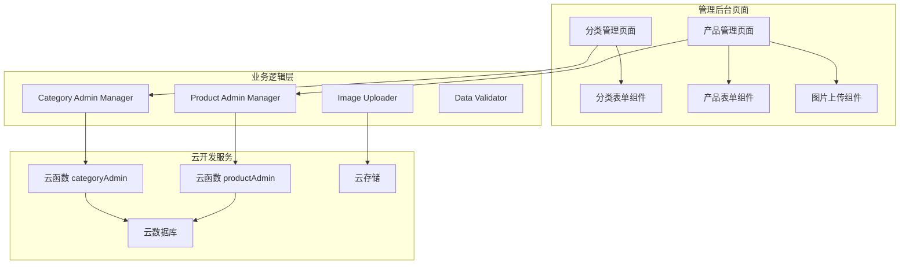

# 设计文档

## 概述

本设计文档描述"年轮环环"微信小程序后台管理系统的技术架构和实现方案。系统提供分类管理和产品管理功能，使用微信云开发作为后端服务。

## 架构

### 整体架构



### 技术栈

- 框架：微信小程序原生框架
- 后端：微信云开发
- 数据库：云数据库（MongoDB）
- 存储：云存储
- 认证：管理员权限验证

## 组件和接口

### 页面结构

| 页面 | 路径 | 功能描述 |
|------|------|----------|
| 分类管理 | pages/admin-category/admin-category | 分类CRUD操作 |
| 产品管理 | pages/admin-product/admin-product | 产品CRUD操作 |
| 分类表单 | pages/category-form/category-form | 新增/编辑分类 |
| 产品表单 | pages/product-form/product-form | 新增/编辑产品 |

### 核心模块接口

#### Category Admin Manager (utils/categoryAdminManager.js)

```javascript
// 获取所有分类
async function getCategories(): Promise<Category[]>

// 根据ID获取分类
async function getCategoryById(id: string): Promise<Category>

// 新增分类
async function addCategory(category: CategoryInput): Promise<{success: boolean, id?: string, error?: string}>

// 更新分类
async function updateCategory(id: string, category: CategoryInput): Promise<{success: boolean, error?: string}>

// 删除分类
async function deleteCategory(id: string): Promise<{success: boolean, error?: string}>

// 检查分类下是否有产品
async function checkCategoryHasProducts(categoryId: string): Promise<boolean>
```

#### Product Admin Manager (utils/productAdminManager.js)

```javascript
// 获取产品列表（支持分页和筛选）
async function getProducts(options: {
  categoryId?: string,
  keyword?: string,
  page?: number,
  pageSize?: number,
  status?: number
}): Promise<{products: Product[], total: number}>

// 根据ID获取产品
async function getProductById(id: string): Promise<Product>

// 新增产品
async function addProduct(product: ProductInput): Promise<{success: boolean, id?: string, error?: string}>

// 更新产品
async function updateProduct(id: string, product: ProductInput): Promise<{success: boolean, error?: string}>

// 删除产品
async function deleteProduct(id: string): Promise<{success: boolean, error?: string}>

// 更新产品状态（上架/下架）
async function updateProductStatus(id: string, status: number): Promise<{success: boolean, error?: string}>

// 批量更新产品状态
async function batchUpdateStatus(ids: string[], status: number): Promise<{success: boolean, count: number, error?: string}>
```

#### Data Validator (utils/dataValidator.js)

```javascript
// 验证分类数据
function validateCategory(category: CategoryInput): {valid: boolean, errors: string[]}

// 验证产品数据
function validateProduct(product: ProductInput): {valid: boolean, errors: string[]}

// 验证价格格式
function validatePrice(price: string | number): boolean
```

## 数据模型

### Category 分类模型

```javascript
{
  _id: string,              // 分类唯一标识
  name: string,             // 分类名称（必填）
  description: string,      // 分类描述
  icon: string,             // 分类图标URL
  image: string,            // 分类图片URL
  order: number,            // 排序权重（数字越小越靠前）
  status: number,           // 状态（1:启用, 0:禁用）
  createTime: Date,         // 创建时间
  updateTime: Date          // 更新时间
}
```

### CategoryInput 分类输入模型

```javascript
{
  name: string,             // 分类名称（必填）
  description?: string,     // 分类描述
  icon?: string,            // 分类图标URL
  image?: string,           // 分类图片URL
  order?: number,           // 排序权重
  status?: number           // 状态
}
```

### Product 产品模型

```javascript
{
  _id: string,              // 产品唯一标识
  name: string,             // 产品名称（必填）
  description: string,      // 产品描述
  price: number | string,   // 价格（数字或"consult"）
  originalPrice: number,    // 原价
  categoryId: string,       // 分类ID（必填）
  imageUrls: string[],      // 主图URL数组
  images: string[],         // 详情图片数组
  features: Feature[],      // 产品特点数组
  params: Param[],          // 产品参数数组
  isHot: boolean,           // 是否热门
  isNew: boolean,           // 是否新品
  isRecommended: boolean,   // 是否推荐
  status: number,           // 状态（1:上架, 0:下架）
  order: number,            // 排序权重
  createTime: Date,         // 创建时间
  updateTime: Date          // 更新时间
}
```

### ProductInput 产品输入模型

```javascript
{
  name: string,             // 产品名称（必填）
  description?: string,     // 产品描述
  price?: number | string,  // 价格
  originalPrice?: number,   // 原价
  categoryId: string,       // 分类ID（必填）
  imageUrls?: string[],     // 主图URL数组
  images?: string[],        // 详情图片数组
  features?: Feature[],     // 产品特点数组
  params?: Param[],         // 产品参数数组
  isHot?: boolean,          // 是否热门
  isNew?: boolean,          // 是否新品
  isRecommended?: boolean,  // 是否推荐
  status?: number,          // 状态
  order?: number            // 排序权重
}
```

## 正确性属性

*正确性属性是系统在所有有效执行中都应保持为真的特征或行为。属性作为人类可读规范和机器可验证正确性保证之间的桥梁。*

### Property 1: 分类新增后可查询

*For any* 有效的分类数据，新增分类后，调用getCategories应返回包含该分类的列表

**Validates: Requirements 2.6**

### Property 2: 分类修改后数据一致

*For any* 已存在的分类，修改后再查询，返回的数据应与修改后的数据一致

**Validates: Requirements 3.5**

### Property 3: 分类删除后不可查询

*For any* 已删除的分类ID，调用getCategoryById应返回null或抛出未找到错误

**Validates: Requirements 4.6**

### Property 4: 产品新增后可查询

*For any* 有效的产品数据，新增产品后，调用getProducts应返回包含该产品的列表

**Validates: Requirements 6.6**

### Property 5: 产品修改后数据一致

*For any* 已存在的产品，修改后再查询，返回的数据应与修改后的数据一致

**Validates: Requirements 7.6**

### Property 6: 产品删除后不可查询

*For any* 已删除的产品ID，调用getProductById应返回null或抛出未找到错误

**Validates: Requirements 8.4**

### Property 7: 产品状态变更一致性

*For any* 产品ID和目标状态，调用updateProductStatus后再查询，产品状态应等于目标状态

**Validates: Requirements 9.5**

### Property 8: 数据验证完整性

*For any* 缺少必填字段的输入数据，validateCategory和validateProduct应返回valid=false

**Validates: Requirements 10.1, 10.2**

## 错误处理

### 数据操作错误

| 场景 | 处理方式 |
|------|----------|
| 新增失败 | 显示错误信息，保留表单数据 |
| 更新失败 | 显示错误信息，保留修改内容 |
| 删除失败 | 显示错误信息，不刷新列表 |
| 网络错误 | 显示网络错误提示，提供重试选项 |

### 验证错误

| 场景 | 处理方式 |
|------|----------|
| 必填字段为空 | 高亮显示字段，显示"此字段为必填项" |
| 分类名称重复 | 显示"分类名称已存在" |
| 价格格式错误 | 显示"请输入有效的价格" |
| 图片上传失败 | 显示"图片上传失败，请重试" |

### 业务逻辑错误

| 场景 | 处理方式 |
|------|----------|
| 删除有产品的分类 | 显示"该分类下有产品，请先删除或移动产品" |
| 权限不足 | 显示"您没有权限执行此操作" |

## 测试策略

### 单元测试

- 测试 Category Admin Manager 的 CRUD 操作
- 测试 Product Admin Manager 的 CRUD 操作
- 测试 Data Validator 的验证逻辑
- 测试状态变更逻辑

### 属性测试

使用 fast-check 库进行属性测试：

- **Property 1-3**: 生成随机分类数据，验证 CRUD 操作的正确性
- **Property 4-6**: 生成随机产品数据，验证 CRUD 操作的正确性
- **Property 7**: 生成随机产品ID和状态，验证状态变更一致性
- **Property 8**: 生成各种无效输入，验证数据验证的完整性

### 集成测试

- 测试分类和产品的关联关系
- 测试云函数调用流程
- 测试图片上传和引用更新

### 测试配置

- 属性测试最少运行100次迭代
- 每个属性测试需标注对应的设计属性编号
- 标签格式: **Feature: admin-management-system, Property {number}: {property_text}**
