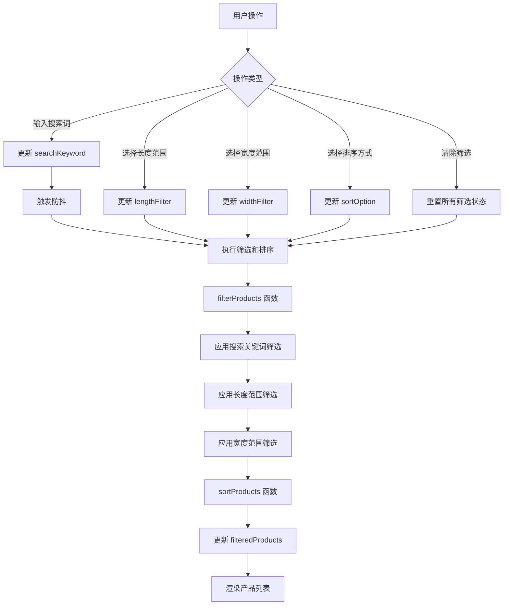

# Design Document: Category Filter and Search

## Overview

本设计为微信小程序产品分类页面添加筛选、搜索和排序功能。用户可以通过长度、宽度范围筛选产品，通过关键词搜索产品标题，以及按不同方式排序产品。所有筛选条件可以组合使用，排序在筛选后应用，实现精确的产品查找。

产品尺寸数据存储在数据库的 `params` 数组中，格式为 `{ name: "规格 (cm)", value: "200*80*4.5" }`，其中第一个数字是长度，第二个数字是宽度。

## Architecture

### 整体架构

```
┌─────────────────────────────────────────────────────────┐
│                    Category Page                         │
├─────────────────────────────────────────────────────────┤
│  ┌─────────────────────────────────────────────────┐   │
│  │           Search & Filter & Sort Bar             │   │
│  │  ┌──────────────┐ ┌──────────┐ ┌──────────┐    │   │
│  │  │ Search Input │ │  Filter  │ │   Sort   │    │   │
│  │  └──────────────┘ └──────────┘ └──────────┘    │   │
│  └─────────────────────────────────────────────────┘   │
│  ┌─────────────────────────────────────────────────┐   │
│  │              Filter Panel (Collapsible)          │   │
│  │  ┌─────────────────────────────────────────┐   │   │
│  │  │              Length Filter               │   │   │
│  │  │  ○ 不限  ○ 150cm以下  ○ 150-180cm      │   │   │
│  │  │  ○ 180-210cm  ○ 210-240cm  ○ 240-270cm │   │   │
│  │  │  ○ 270-300cm  ○ 300-350cm  ○ 350-400cm │   │   │
│  │  │  ○ 400-500cm  ○ 500cm以上              │   │   │
│  │  └─────────────────────────────────────────┘   │   │
│  │  ┌─────────────────────────────────────────┐   │   │
│  │  │              Width Filter                │   │   │
│  │  │  ○ 不限  ○ 60cm以下  ○ 60-80cm         │   │   │
│  │  │  ○ 80-100cm  ○ 100-120cm  ○ 120-140cm  │   │   │
│  │  │  ○ 140cm以上                            │   │   │
│  │  └─────────────────────────────────────────┘   │   │
│  │  ┌─────────────────────────────────────────┐   │   │
│  │  │         Clear All Filters Button         │   │   │
│  │  └─────────────────────────────────────────┘   │   │
│  └─────────────────────────────────────────────────┘   │
│  ┌─────────────────────────────────────────────────┐   │
│  │           Active Filter Indicators              │   │
│  └─────────────────────────────────────────────────┘   │
│  ┌─────────────────────────────────────────────────┐   │
│  │              Product List / Empty State          │   │
│  └─────────────────────────────────────────────────┘   │
└─────────────────────────────────────────────────────────┘
```

### 数据流



## Components and Interfaces

### 1. FilterBar 组件

位置：集成在 `pages/category/category.wxml` 中

```javascript
// 筛选栏数据结构
{
  searchKeyword: '',        // 搜索关键词
  showFilterPanel: false,   // 筛选面板是否展开
  lengthFilter: null,       // 当前选中的长度范围 { min, max, label }
  widthFilter: null,        // 当前选中的宽度范围 { min, max, label }
  sortOption: 'default',    // 当前排序方式
  showSortDropdown: false,  // 排序下拉菜单是否展开
}
```

### 2. FilterPanel 组件

筛选面板，包含长度和宽度筛选选项。

```javascript
// 筛选选项配置
const FILTER_OPTIONS = {
  length: [
    { min: null, max: null, label: '不限' },
    { min: 0, max: 150, label: '150cm以下' },
    { min: 150, max: 180, label: '150-180cm' },
    { min: 180, max: 210, label: '180-210cm' },
    { min: 210, max: 240, label: '210-240cm' },
    { min: 240, max: 270, label: '240-270cm' },
    { min: 270, max: 300, label: '270-300cm' },
    { min: 300, max: 350, label: '300-350cm' },
    { min: 350, max: 400, label: '350-400cm' },
    { min: 400, max: 500, label: '400-500cm' },
    { min: 500, max: Infinity, label: '500cm以上' }
  ],
  width: [
    { min: null, max: null, label: '不限' },
    { min: 0, max: 60, label: '60cm以下' },
    { min: 60, max: 80, label: '60-80cm' },
    { min: 80, max: 100, label: '80-100cm' },
    { min: 100, max: 120, label: '100-120cm' },
    { min: 120, max: 140, label: '120-140cm' },
    { min: 140, max: Infinity, label: '140cm以上' }
  ]
};

// 排序选项配置
const SORT_OPTIONS = [
  { value: 'default', label: '默认排序' },
  { value: 'newest', label: '最新优先' },
  { value: 'priceAsc', label: '价格升序' },
  { value: 'priceDesc', label: '价格降序' }
];
```

### 3. ProductFilter 工具模块

更新 `utils/productFilter.js`，提供筛选和排序逻辑。

```javascript
/**
 * 产品筛选和排序工具模块
 */

/**
 * 从产品对象中获取尺寸字符串
 * 从 params 数组中查找 "规格" 参数
 * @param {Object} product - 产品对象
 * @returns {string|null} 尺寸字符串，如 "200*80*4.5"
 */
function getSizeFromProduct(product) {}

/**
 * 解析产品尺寸字符串
 * @param {string} sizeStr - 尺寸字符串，如 "200*80*4.5"
 * @returns {Object} { length: number|null, width: number|null, height: number|null }
 */
function parseSize(sizeStr) {}

/**
 * 根据搜索关键词筛选产品
 * @param {Array} products - 产品列表
 * @param {string} keyword - 搜索关键词
 * @returns {Array} 筛选后的产品列表
 */
function filterByKeyword(products, keyword) {}

/**
 * 根据长度范围筛选产品
 * @param {Array} products - 产品列表
 * @param {Object} range - 长度范围 { min, max }
 * @returns {Array} 筛选后的产品列表
 */
function filterByLength(products, range) {}

/**
 * 根据宽度范围筛选产品
 * @param {Array} products - 产品列表
 * @param {Object} range - 宽度范围 { min, max }
 * @returns {Array} 筛选后的产品列表
 */
function filterByWidth(products, range) {}

/**
 * 组合筛选
 * @param {Array} products - 产品列表
 * @param {Object} filters - 筛选条件
 * @returns {Array} 筛选后的产品列表
 */
function applyFilters(products, filters) {}

/**
 * 排序产品列表
 * @param {Array} products - 产品列表
 * @param {string} sortOption - 排序方式 ('default', 'newest', 'priceAsc', 'priceDesc')
 * @returns {Array} 排序后的产品列表
 */
function sortProducts(products, sortOption) {}

/**
 * 解析产品价格为数字
 * @param {string|number} price - 价格值
 * @returns {number} 数字价格，"联系销售" 返回 Infinity
 */
function parsePrice(price) {}
```

## Data Models

### 筛选状态数据模型

```javascript
// 页面 data 中新增的筛选相关字段
{
  // 搜索相关
  searchKeyword: '',           // 当前搜索关键词
  searchInputValue: '',        // 输入框中的值（用于防抖）
  
  // 筛选面板
  showFilterPanel: false,      // 筛选面板是否展开
  
  // 长度筛选
  lengthFilter: null,          // 当前选中的长度范围
  lengthOptions: [             // 长度筛选选项
    { min: null, max: null, label: '不限' },
    { min: 0, max: 150, label: '150cm以下' },
    { min: 150, max: 180, label: '150-180cm' },
    { min: 180, max: 210, label: '180-210cm' },
    { min: 210, max: 240, label: '210-240cm' },
    { min: 240, max: 270, label: '240-270cm' },
    { min: 270, max: 300, label: '270-300cm' },
    { min: 300, max: 350, label: '300-350cm' },
    { min: 350, max: 400, label: '350-400cm' },
    { min: 400, max: 500, label: '400-500cm' },
    { min: 500, max: Infinity, label: '500cm以上' }
  ],
  
  // 宽度筛选
  widthFilter: null,           // 当前选中的宽度范围
  widthOptions: [              // 宽度筛选选项
    { min: null, max: null, label: '不限' },
    { min: 0, max: 60, label: '60cm以下' },
    { min: 60, max: 80, label: '60-80cm' },
    { min: 80, max: 100, label: '80-100cm' },
    { min: 100, max: 120, label: '100-120cm' },
    { min: 120, max: 140, label: '120-140cm' },
    { min: 140, max: Infinity, label: '140cm以上' }
  ],
  
  // 排序相关
  sortOption: 'default',       // 当前排序方式
  showSortDropdown: false,     // 排序下拉菜单是否展开
  sortOptions: [               // 排序选项
    { value: 'default', label: '默认排序' },
    { value: 'newest', label: '最新优先' },
    { value: 'priceAsc', label: '价格升序' },
    { value: 'priceDesc', label: '价格降序' }
  ],
  
  // 筛选结果
  filteredProducts: [],        // 筛选后的产品列表
  hasActiveFilters: false,     // 是否有激活的筛选条件
  
  // 原始产品列表（用于筛选）
  allProducts: []              // 当前分类的所有产品
}
```

### 产品尺寸数据

产品数据中的尺寸信息存储在 `params` 数组中：

```javascript
// 数据库中的产品数据格式
{
  _id: "product_id",
  name: "产品名称",
  price: "1999",  // 或 "联系销售"
  createTime: "2024-01-01T00:00:00.000Z",
  params: [
    {
      name: "规格 (cm)",
      value: "200*80*4.5"  // 长度*宽度*高度
    },
    // ... 其他参数
  ]
}
```

解析规则：
- 从 `params` 数组中查找 `name` 包含 "规格" 的项
- `value` 格式为 `"长度*宽度*高度"` 或 `"长度*宽度"`
- 第一个数字是长度，第二个数字是宽度

## Correctness Properties

*A property is a characteristic or behavior that should hold true across all valid executions of a system—essentially, a formal statement about what the system should do. Properties serve as the bridge between human-readable specifications and machine-verifiable correctness guarantees.*

### Property 1: Filter Panel Toggle

*For any* initial panel state (open or closed), clicking the filter button should toggle the panel to the opposite state.

**Validates: Requirements 1.2, 1.3**

### Property 2: Single Selection for Dimension Filters

*For any* sequence of filter selections on length or width filters, only the most recently selected option should be active.

**Validates: Requirements 2.5, 3.5**

### Property 3: Combined Filter Correctness

*For any* product list and any combination of active filters (search keyword, length range, width range), all products in the filtered result should satisfy ALL active filter criteria simultaneously.

**Validates: Requirements 2.2, 3.2, 4.2, 5.1**

### Property 4: Filter Clear Restores Products

*For any* filtered state, clearing all filters should restore the product list to show all products in the current category (matching only the category filter).

**Validates: Requirements 2.4, 3.4, 4.4, 5.3**

### Property 5: Case-Insensitive Search

*For any* search keyword, searching with different letter cases (uppercase, lowercase, mixed) should return the same set of products.

**Validates: Requirements 4.6**

### Property 6: Size Parsing Consistency

*For any* valid size string in the format "L*W*H" or "L*W" from product params array where name contains "规格", parsing should correctly extract length (first number) and width (second number) values.

**Validates: Requirements 2.6, 3.6**

### Property 7: Filter State Preservation

*For any* active filter state, switching to a different category and back should preserve the filter state.

**Validates: Requirements 5.4**

### Property 8: Sorting Correctness

*For any* product list:
- When sorted by "最新优先", products should be ordered by creation date in descending order
- When sorted by "价格升序", products should be ordered by price in ascending order (with "联系销售" treated as highest)
- When sorted by "价格降序", products should be ordered by price in descending order (with "联系销售" treated as highest)

**Validates: Requirements 7.4, 7.5, 7.6, 7.9**

### Property 9: Sorting Applied After Filtering

*For any* combination of filters and sort option, the sorting should be applied to the filtered results, not the original product list.

**Validates: Requirements 7.8**

## Error Handling

### 1. 尺寸解析错误

当产品的 `size` 字段格式不正确或为空时：
- 返回 `{ length: null, width: null }`
- 该产品在尺寸筛选时被排除（不显示）
- 记录警告日志便于调试

### 2. 搜索输入处理

- 空字符串或纯空格：不执行搜索筛选
- 特殊字符：进行转义处理，避免正则表达式错误
- 超长输入：限制最大长度为 50 字符

### 3. 筛选结果为空

- 显示友好的空状态提示
- 提供"清除筛选"快捷按钮
- 显示当前激活的筛选条件

## Testing Strategy

### 单元测试

使用 Jest 测试框架，测试以下模块：

1. **ProductFilter 模块测试**
   - `parseSize()` 函数的各种输入格式
   - `getSizeFromProduct()` 从 params 数组提取尺寸
   - `filterByKeyword()` 的搜索匹配逻辑
   - `filterByLength()` 和 `filterByWidth()` 的范围筛选
   - `applyFilters()` 的组合筛选逻辑
   - `sortProducts()` 的排序逻辑
   - `parsePrice()` 的价格解析逻辑

2. **边界情况测试**
   - 空产品列表
   - 空筛选条件
   - 无效尺寸格式
   - 特殊字符搜索
   - "联系销售" 价格排序
   - "不限" 选项处理

### 属性测试

使用 fast-check 库进行属性测试，每个属性测试运行至少 100 次迭代。

测试标签格式：`**Feature: category-filter-search, Property N: [property_text]**`

1. **Property 1 测试**: 筛选面板切换
2. **Property 2 测试**: 单选模式
3. **Property 3 测试**: 组合筛选正确性
4. **Property 4 测试**: 清除筛选恢复
5. **Property 5 测试**: 大小写不敏感搜索
6. **Property 6 测试**: 尺寸解析一致性
7. **Property 7 测试**: 筛选状态保持
8. **Property 8 测试**: 排序正确性
9. **Property 9 测试**: 排序在筛选后应用

### 测试配置

```javascript
// jest.config.js 中添加
{
  testMatch: ['**/__tests__/**/*.test.js'],
  setupFilesAfterEnv: ['./jest.setup.js']
}
```

属性测试配置：
- 最小迭代次数：100
- 使用 fast-check 的 `fc.assert()` 和 `fc.property()`
