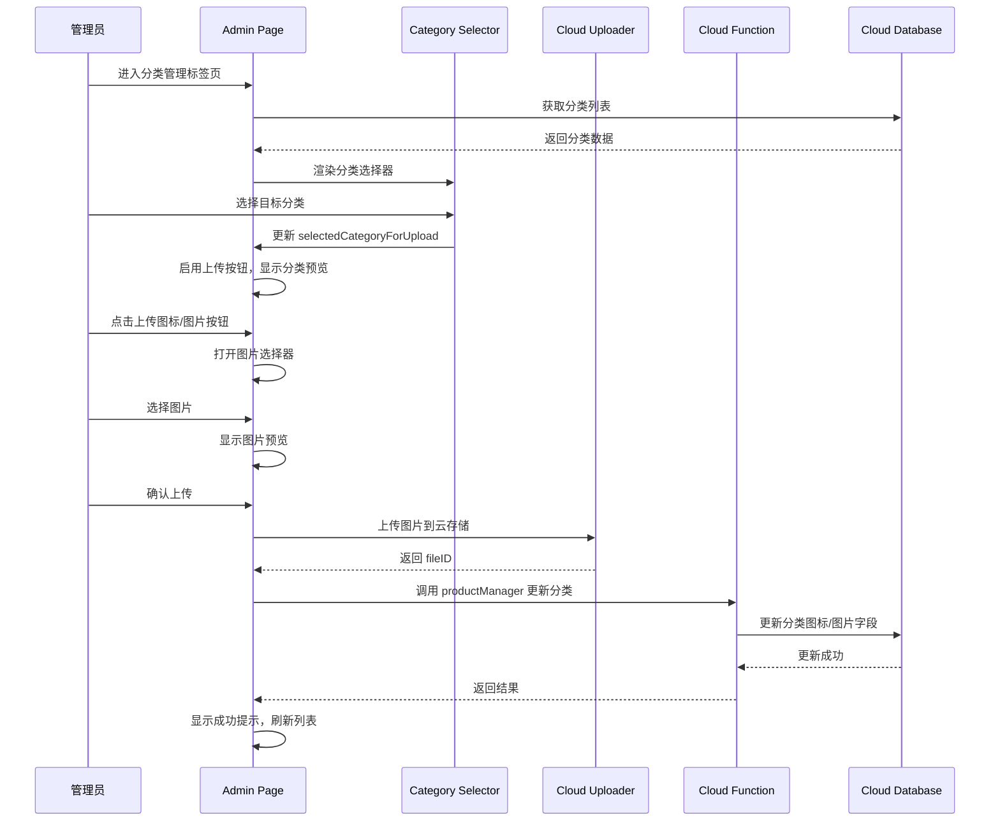

# Design Document: Category Image Upload Enhancement

## Overview

本设计文档描述了分类管理页面中分类图片上传功能的改进方案。主要改进是在管理员后台的分类管理标签页中添加明确的分类选择器，让用户能够清晰地选择要上传图片的目标分类，而不是依赖于在列表中点击选择的隐式交互。

## Architecture

### 组件结构

```
pages/admin/admin
├── 分类管理标签页 (categories tab)
│   ├── 分类管理入口卡片 (现有)
│   ├── 分类图片上传区域 (新增/改进)
│   │   ├── 分类选择器 (Category Selector)
│   │   ├── 当前分类预览 (Current Category Preview)
│   │   └── 上传按钮组 (Upload Buttons)
│   └── 快速预览列表 (现有)
```

### 数据流



## Components and Interfaces

### 1. 页面数据扩展 (admin.js data)

```javascript
data: {
  // ... 现有数据 ...
  
  // 分类图片上传相关
  selectedCategoryForUpload: null,  // 选中用于上传的分类对象
  categoryUploadType: '',           // 上传类型: 'icon' 或 'image'
  categoryTempImage: '',            // 临时图片路径（用于预览）
  categoryUploading: false,         // 上传中状态
}
```

### 2. 分类选择器接口

```javascript
/**
 * 分类选择器变更处理
 * @param {Object} e - 事件对象
 * @param {number} e.detail.value - 选中的分类索引
 */
onCategorySelectChange(e) {
  const index = e.detail.value;
  const category = this.data.categories[index];
  this.setData({
    selectedCategoryForUpload: category,
    categoryTempImage: ''  // 清除之前的临时图片
  });
}
```

### 3. 图片上传接口

```javascript
/**
 * 选择并上传分类图片
 * @param {string} type - 上传类型: 'icon' 或 'image'
 */
async chooseCategoryImageForUpload(type) {
  if (!this.data.selectedCategoryForUpload) {
    wx.showToast({ title: '请先选择分类', icon: 'none' });
    return;
  }
  // ... 图片选择和上传逻辑
}

/**
 * 确认上传分类图片
 */
async confirmCategoryImageUpload() {
  // ... 上传确认逻辑
}
```

## Data Models

### 分类数据模型 (Category)

```javascript
{
  _id: string,           // 分类ID
  name: string,          // 分类名称
  description: string,   // 分类描述
  icon: string,          // 分类图标 (云存储 fileID)
  image: string,         // 分类图片 (云存储 fileID)
  order: number,         // 排序权重
  status: number,        // 状态: 1-启用, 0-禁用
  createTime: Date,      // 创建时间
  updateTime: Date       // 更新时间
}
```

### 上传状态模型

```javascript
{
  selectedCategoryForUpload: Category | null,  // 选中的分类
  categoryUploadType: 'icon' | 'image' | '',   // 上传类型
  categoryTempImage: string,                    // 临时图片路径
  categoryUploading: boolean                    // 上传中状态
}
```

## Correctness Properties

*A property is a characteristic or behavior that should hold true across all valid executions of a system-essentially, a formal statement about what the system should do. Properties serve as the bridge between human-readable specifications and machine-verifiable correctness guarantees.*

### Property 1: 分类选择器数据完整性

*For any* 分类列表，当分类选择器加载完成后，选择器中的选项数量应该等于分类列表的长度，且每个选项的名称应该与对应分类的名称一致。

**Validates: Requirements 1.2, 2.2**

### Property 2: 上传按钮状态联动

*For any* 页面状态，当 `selectedCategoryForUpload` 为 null 时，上传按钮应该处于禁用状态；当 `selectedCategoryForUpload` 不为 null 时，上传按钮应该处于启用状态。

**Validates: Requirements 2.3, 2.4**

### Property 3: 分类字段更新正确性

*For any* 分类和图片类型（icon 或 image），当图片上传成功后，对应分类的相应字段（icon 或 image）应该被更新为新的 fileID，且其他字段保持不变。

**Validates: Requirements 3.5**

### Property 4: 错误信息显示

*For any* 上传错误，系统应该返回包含错误信息的结果对象，且错误信息不为空字符串。

**Validates: Requirements 4.3**

### Property 5: 分类预览和按钮文本显示

*For any* 已选分类，如果该分类的 icon 字段不为空，则应显示图标预览且按钮文本为"更换图标"；如果 icon 字段为空，则按钮文本为"上传图标"。同理适用于 image 字段。

**Validates: Requirements 5.2, 5.3**

## Error Handling

### 错误类型和处理策略

| 错误类型 | 错误信息 | 处理方式 |
|---------|---------|---------|
| 未选择分类 | "请先选择分类" | Toast 提示，阻止操作 |
| 图片选择取消 | - | 静默处理，不显示错误 |
| 云存储上传失败 | "上传失败，请重试" | Toast 提示 |
| 云函数调用失败 | "更新失败，请重试" | Modal 提示 |
| 网络连接失败 | "网络连接失败，请检查网络后重试" | Modal 提示 |

### 错误处理代码示例

```javascript
async confirmCategoryImageUpload() {
  try {
    this.setData({ categoryUploading: true });
    
    // 上传图片到云存储
    const fileID = await uploadCategoryImage(
      this.data.categoryTempImage,
      this.data.selectedCategoryForUpload.name,
      this.data.categoryUploadType
    );
    
    if (!fileID) {
      throw new Error('上传失败，请重试');
    }
    
    // 更新分类数据
    const result = await wx.cloud.callFunction({
      name: 'productManager',
      data: {
        action: 'updateCategory',
        data: {
          id: this.data.selectedCategoryForUpload._id,
          [this.data.categoryUploadType]: fileID
        }
      }
    });
    
    if (!result.result || !result.result.success) {
      throw new Error(result.result?.error || '更新失败，请重试');
    }
    
    // 成功处理
    wx.showToast({ title: '上传成功', icon: 'success' });
    this.refreshCategoriesData();
    this.resetCategoryUploadState();
    
  } catch (error) {
    // 错误处理
    let errorMessage = error.message || '操作失败，请重试';
    if (error.message && error.message.includes('network')) {
      errorMessage = '网络连接失败，请检查网络后重试';
    }
    
    wx.showModal({
      title: '上传失败',
      content: errorMessage,
      showCancel: false
    });
  } finally {
    this.setData({ categoryUploading: false });
  }
}
```

## Testing Strategy

### 单元测试

单元测试用于验证具体的示例和边界情况：

1. **初始状态测试**
   - 验证页面加载时 `selectedCategoryForUpload` 为 null
   - 验证初始状态下上传按钮被禁用

2. **边界情况测试**
   - 分类列表为空时的处理
   - 网络错误时的错误信息显示

### 属性测试

使用 fast-check 进行属性测试，验证通用属性在所有输入下都成立：

1. **Property 1: 分类选择器数据完整性**
   - 生成随机分类列表
   - 验证选择器选项与分类列表一一对应

2. **Property 2: 上传按钮状态联动**
   - 生成随机的 selectedCategoryForUpload 状态
   - 验证按钮状态与选择状态的对应关系

3. **Property 3: 分类字段更新正确性**
   - 生成随机分类和图片类型
   - 验证更新后只有目标字段被修改

4. **Property 4: 错误信息显示**
   - 生成随机错误类型
   - 验证错误信息不为空

5. **Property 5: 分类预览和按钮文本显示**
   - 生成随机分类（有/无图标和图片）
   - 验证预览显示和按钮文本的正确性

### 测试配置

- 属性测试框架: fast-check
- 每个属性测试最少运行 100 次迭代
- 测试标签格式: `Feature: category-image-upload, Property N: {property_text}`
