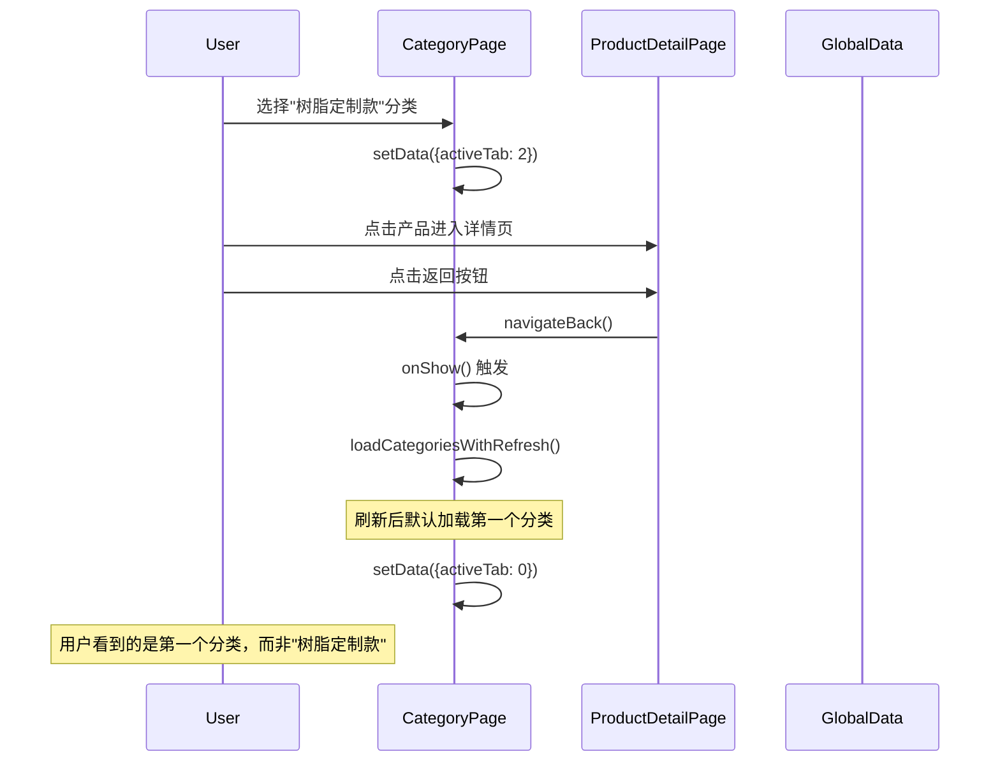
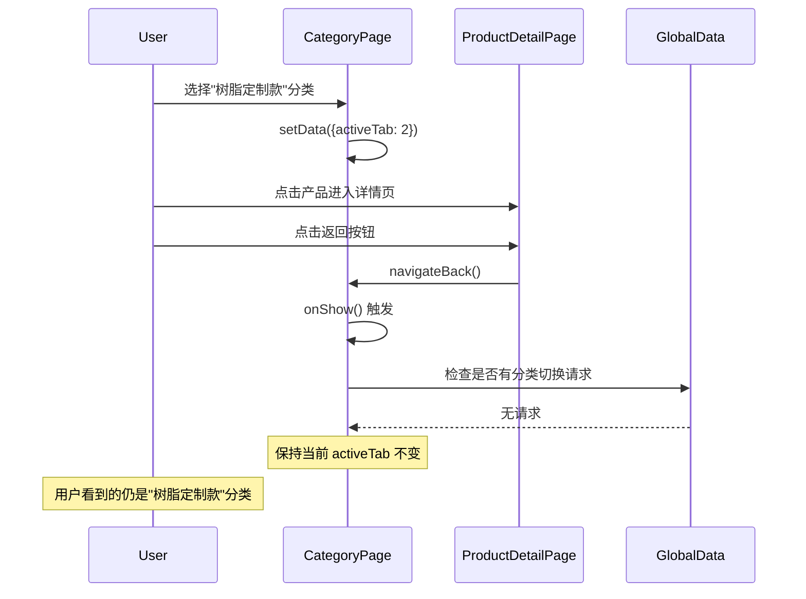

# Design Document: Category Navigation Fix

## Overview

本设计文档描述了修复产品详情页返回分类页时导航错误的技术方案。核心问题是分类页的 `onShow` 生命周期方法每次都会强制刷新分类数据，导致用户从详情页返回时分类状态丢失。

解决方案的核心思路是：
1. 引入导航来源标识，区分"跳转进入"和"返回进入"
2. 优化 `onShow` 方法的刷新策略，仅在必要时刷新数据
3. 在刷新数据时保存并恢复当前的分类索引

## Architecture

### 当前架构问题



### 修复后架构



## Components and Interfaces

### 1. Category Page 状态管理

#### 新增数据属性

```javascript
data: {
  // ... 现有属性
  isFirstLoad: true,           // 是否首次加载
  lastActiveTab: 0,            // 上次选中的分类索引（用于刷新后恢复）
  needRefreshOnShow: false     // 是否需要在 onShow 时刷新
}
```

#### 修改的方法

**onLoad 方法**
- 设置 `isFirstLoad: true`
- 首次加载分类数据

**onShow 方法**
- 检查全局数据中是否有分类切换请求
- 如果有请求，处理分类切换并清除请求
- 如果没有请求且不是首次加载，保持当前状态不变
- 移除强制刷新逻辑

**loadCategoriesWithRefresh 方法**
- 在刷新前保存当前 `activeTab` 到 `lastActiveTab`
- 刷新完成后，如果没有待切换的分类，恢复到 `lastActiveTab`

### 2. 全局数据管理

#### 数据结构

```javascript
// app.globalData.eventChannel
{
  categoryType: null,    // 分类名称
  categoryId: null,      // 分类ID
  isNavigating: false    // 是否正在导航（可选，用于更精确的控制）
}
```

#### 清理时机

- 分类页处理完分类切换请求后立即清除
- 避免残留数据影响后续导航

## Data Models

本修复不涉及数据模型的变更，仅涉及页面状态管理。

## Correctness Properties

*A property is a characteristic or behavior that should hold true across all valid executions of a system-essentially, a formal statement about what the system should do. Properties serve as the bridge between human-readable specifications and machine-verifiable correctness guarantees.*

### Property 1: 返回时保持分类状态

*For any* 分类页当前选中的分类索引 activeTab，当用户从产品详情页返回分类页时，如果全局数据中没有分类切换请求，则 activeTab 应该保持不变。

**Validates: Requirements 1.1, 1.4, 2.2**

### Property 2: 返回时不触发数据刷新

*For any* 从详情页返回分类页的导航操作，如果全局数据中没有分类切换请求，则不应该触发 `loadCategoriesWithRefresh` 方法。

**Validates: Requirements 1.2, 3.2**

### Property 3: 分类切换请求处理后清除全局数据

*For any* 全局数据中存在的分类切换请求（categoryType 或 categoryId 非空），在分类页处理完该请求后，全局数据中的 categoryType 和 categoryId 应该被设置为 null。

**Validates: Requirements 2.3**

### Property 4: 刷新后恢复分类状态

*For any* 分类页当前选中的分类索引 activeTab，当触发数据刷新（如下拉刷新）时，刷新完成后 activeTab 应该恢复到刷新前的值（除非有新的分类切换请求）。

**Validates: Requirements 2.4, 3.4**

### Property 5: 指定分类跳转正确切换

*For any* 从首页或侧边栏发起的分类跳转请求，如果指定了 categoryId 或 categoryType，分类页应该切换到对应的分类索引。

**Validates: Requirements 2.1**

## Error Handling

### 边界情况处理

1. **分类索引越界**
   - 如果保存的 `lastActiveTab` 超出当前分类数组长度，回退到索引 0
   
2. **全局数据对象不存在**
   - 在访问全局数据前检查对象是否存在
   - 如果不存在，创建默认结构

3. **分类数据为空**
   - 如果分类数组为空，显示空状态提示
   - 不尝试设置 activeTab

## Testing Strategy

### 单元测试

1. **onShow 行为测试**
   - 测试无分类切换请求时 activeTab 保持不变
   - 测试有分类切换请求时正确切换分类
   - 测试请求处理后全局数据被清除

2. **刷新恢复测试**
   - 测试刷新前后 activeTab 一致性
   - 测试刷新时有新请求的情况

### 属性测试

使用 Jest 和 fast-check 进行属性测试：

1. **Property 1 测试**: 生成随机的 activeTab 值，模拟返回导航，验证状态保持
2. **Property 3 测试**: 生成随机的分类切换请求，验证处理后数据被清除
3. **Property 4 测试**: 生成随机的 activeTab 值，模拟刷新操作，验证状态恢复
4. **Property 5 测试**: 生成随机的分类ID/名称，验证正确切换

### 集成测试

1. 完整导航流程测试：首页 → 分类页 → 详情页 → 返回分类页
2. 多次导航测试：验证多次进入退出后状态正确
