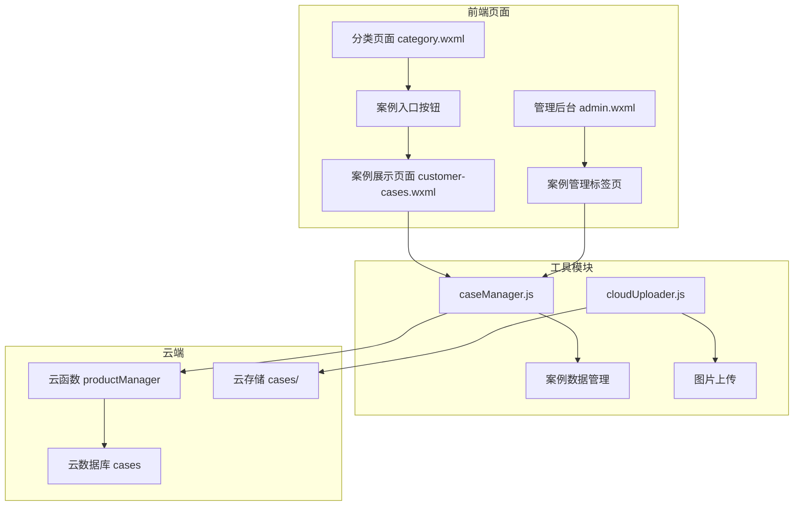

# Design Document: Customer Cases Feature

## Overview

本设计文档描述客户案例功能的技术实现方案。该功能为树脂定制款分类页面添加客户案例展示入口，创建独立的案例展示页面，并在管理后台提供案例管理功能。

## Architecture



## Components and Interfaces

### 1. 案例入口按钮组件 (Category Page)

在 `pages/category/category.wxml` 中添加条件渲染的按钮：

```xml
<!-- 案例入口按钮 - 仅在树脂定制款分类显示 -->
<view class="case-entry" 
      wx:if="{{categories[activeTab] && categories[activeTab]._id === 'cat_custom'}}"
      bindtap="navigateToCases">
  <view class="case-entry-text">查看更多定制案例</view>
  <view class="case-entry-arrow">→</view>
</view>
```

### 2. 案例展示页面 (customer-cases)

新建页面 `pages/customer-cases/`，包含以下文件：
- `customer-cases.js` - 页面逻辑
- `customer-cases.wxml` - 页面结构
- `customer-cases.wxss` - 页面样式
- `customer-cases.json` - 页面配置

页面结构参考 `pages/new-products/new-products.wxml`。

### 3. 案例管理模块 (caseManager.js)

新建工具模块 `utils/caseManager.js`：

```javascript
/**
 * 案例管理模块
 * 提供案例的增删改查功能
 */

/**
 * 获取所有启用的案例（用于前台展示）
 * @returns {Promise<Array>} 案例列表
 */
async function getActiveCases() {}

/**
 * 获取所有案例（用于管理后台）
 * @returns {Promise<Array>} 案例列表
 */
async function getAllCases() {}

/**
 * 创建新案例
 * @param {Object} caseData - 案例数据
 * @returns {Promise<Object>} 创建结果
 */
async function createCase(caseData) {}

/**
 * 更新案例
 * @param {string} caseId - 案例ID
 * @param {Object} updateData - 更新数据
 * @returns {Promise<Object>} 更新结果
 */
async function updateCase(caseId, updateData) {}

/**
 * 删除案例
 * @param {string} caseId - 案例ID
 * @returns {Promise<Object>} 删除结果
 */
async function deleteCase(caseId) {}

/**
 * 生成下一个案例ID
 * @returns {Promise<string>} 新的案例ID
 */
async function generateNextCaseId() {}

/**
 * 验证案例数据
 * @param {Object} caseData - 案例数据
 * @returns {Object} 验证结果 {valid: boolean, errors: Array}
 */
function validateCaseData(caseData) {}

/**
 * 验证图片文件
 * @param {string} filePath - 文件路径
 * @returns {Object} 验证结果 {valid: boolean, error: string}
 */
function validateImageFile(filePath) {}

/**
 * 按排序规则排序案例
 * @param {Array} cases - 案例列表
 * @returns {Array} 排序后的案例列表
 */
function sortCases(cases) {}
```

### 4. 云函数扩展 (productManager)

在 `cloudfunctions/productManager/index.js` 中添加案例管理相关 action：

```javascript
// 新增 action 类型
case 'getCases':        // 获取案例列表
case 'addCase':         // 新增案例
case 'updateCase':      // 更新案例
case 'deleteCase':      // 删除案例
case 'getNextCaseId':   // 获取下一个案例ID
```

### 5. 图片上传扩展 (cloudUploader.js)

在 `utils/cloudUploader.js` 中添加案例图片上传函数：

```javascript
/**
 * 上传案例图片到云存储
 * @param {string} tempFilePath - 临时文件路径
 * @param {string} caseId - 案例ID
 * @returns {Promise<string>} 云存储文件ID
 */
async function uploadCaseImage(tempFilePath, caseId) {}
```

## Data Models

### 案例数据模型 (cases collection)

```javascript
{
  "_id": "case1",              // 案例ID，格式: case{number}
  "title": "客户定制案例",      // 案例标题
  "description": "案例描述",    // 案例描述
  "imageUrl": "cloud://...",   // 云存储图片URL
  "order": 1,                  // 排序权重（越小越靠前）
  "status": 1,                 // 状态：1-启用，0-禁用
  "createTime": Date,          // 创建时间
  "updateTime": Date           // 更新时间
}
```

### 云存储路径规范

```
cloud://your-env-id/
└── cases/                    # 案例图片目录
    ├── case1.jpg
    ├── case2.png
    └── case3.jpeg
```

### 图片命名规范

- 路径: `cases/`
- 文件名: `case{number}.{ext}`
- 支持格式: jpg, jpeg, png
- 最大文件大小: 2MB

## Correctness Properties

*A property is a characteristic or behavior that should hold true across all valid executions of a system—essentially, a formal statement about what the system should do. Properties serve as the bridge between human-readable specifications and machine-verifiable correctness guarantees.*

### Property 1: Case Button Visibility

*For any* category page view, the case entry button should be visible if and only if the current category ID is "cat_custom".

**Validates: Requirements 1.5**

### Property 2: Case Count Display Accuracy

*For any* list of active cases, the displayed count text should exactly match the actual number of cases in the list.

**Validates: Requirements 2.2**

### Property 3: Case Data Completeness

*For any* case object, it must contain all required fields (_id, title, description, imageUrl, order, status, createTime, updateTime) with valid values.

**Validates: Requirements 3.1, 2.4, 4.2**

### Property 4: Case ID and Image Path Generation

*For any* generated case ID, it must match the pattern "case{number}" where number is a positive integer. *For any* case image path, it must follow the format "cases/case{number}.{ext}" where ext is one of (jpg, jpeg, png).

**Validates: Requirements 3.2, 3.3, 5.1, 5.2, 5.4**

### Property 5: Image Validation

*For any* uploaded file, the validation function should accept files with extensions (jpg, jpeg, png) and size ≤ 2MB, and reject all others.

**Validates: Requirements 4.4**

### Property 6: Case Creation Round Trip

*For any* valid case data submitted through the admin form, after saving, querying the database should return a case with matching title, description, and a valid cloud storage image URL.

**Validates: Requirements 4.5**

### Property 7: Case Edit Form Pre-population

*For any* existing case, when editing, the form should be pre-populated with all existing field values (title, description, order, status, imageUrl).

**Validates: Requirements 4.6**

### Property 8: Case Sorting

*For any* list of cases, the sorted result should be ordered by: (1) order field ascending, (2) for cases with equal order, by createTime descending (newest first).

**Validates: Requirements 6.1, 6.5**

### Property 9: Active Case Filtering

*For any* list of cases with mixed status values, the filtered result for display should contain only cases where status equals 1.

**Validates: Requirements 6.2**

## Error Handling

### 图片上传错误

| 错误类型 | 错误信息 | 处理方式 |
|---------|---------|---------|
| 格式不支持 | "仅支持 jpg、jpeg、png 格式" | 阻止上传，显示提示 |
| 文件过大 | "图片大小不能超过 2MB" | 阻止上传，显示提示 |
| 网络错误 | "网络连接失败，请重试" | 显示重试按钮 |
| 云存储错误 | "上传失败，请重试" | 显示错误详情 |

### 数据操作错误

| 错误类型 | 错误信息 | 处理方式 |
|---------|---------|---------|
| 案例不存在 | "案例不存在或已删除" | 刷新列表 |
| 保存失败 | "保存失败，请重试" | 保留表单数据，允许重试 |
| 删除失败 | "删除失败，请重试" | 显示错误详情 |

## Testing Strategy

### 单元测试

使用 Jest 框架进行单元测试：

1. **caseManager.js 测试**
   - 测试 `validateCaseData` 函数的各种输入情况
   - 测试 `validateImageFile` 函数的格式和大小验证
   - 测试 `sortCases` 函数的排序逻辑
   - 测试 `generateNextCaseId` 函数的ID生成

2. **cloudUploader.js 测试**
   - 测试 `uploadCaseImage` 函数的路径生成

### 属性测试

使用 fast-check 库进行属性测试，每个属性测试运行至少 100 次迭代：

1. **Property 1**: 按钮可见性属性测试
2. **Property 2**: 案例计数准确性属性测试
3. **Property 3**: 案例数据完整性属性测试
4. **Property 4**: ID和路径生成属性测试
5. **Property 5**: 图片验证属性测试
6. **Property 6**: 案例创建往返属性测试
7. **Property 7**: 编辑表单预填充属性测试
8. **Property 8**: 案例排序属性测试
9. **Property 9**: 活跃案例过滤属性测试

### 测试文件结构

```
__tests__/
├── property/
│   └── case-manager.property.test.js    # 属性测试
└── utils/
    └── caseManager.test.js              # 单元测试
```
